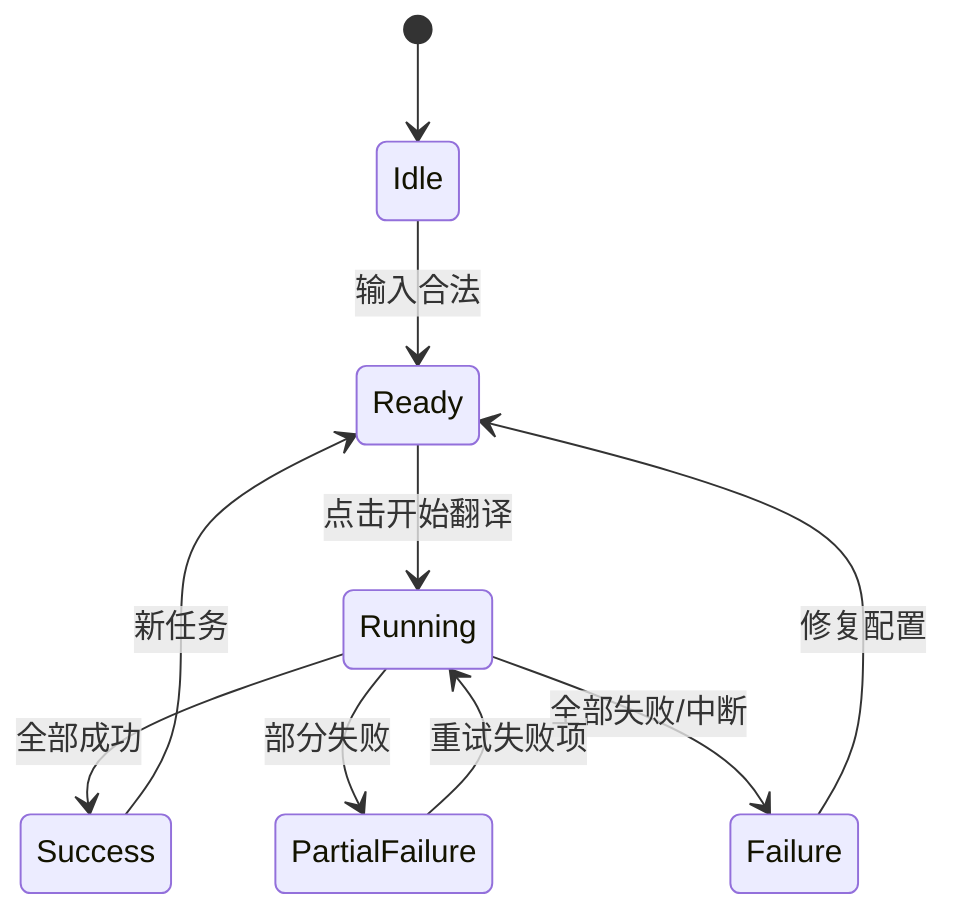

# Chapter 1C 交互稿（Interaction Spec）

## 1. 全局交互规则
- 长任务必须展示进度与当前阶段（准备中/执行中/完成/失败）。
- 所有失败都必须带可执行动作（重试、修复设置、查看详情）。
- 不可逆动作必须二次确认（覆盖输出、删除记录）。
- 输入校验前置，避免“运行后才报参数错误”。

## 2. 状态模型

## 3. 核心流程

## 流程 A：首次启动 -> 首个任务完成
1. 用户打开应用，进入“工作台”。
2. 点击“新建翻译任务”，进入“翻译任务”。
3. 选择文件/目录，配置 Provider 与输出策略。
4. 点击“开始翻译”，进入运行态。
5. 完成后自动跳转或提示进入“结果中心”。
6. 用户点击“打开输出”，在 Typora 查看。

### 异常处理
- 未选择路径：阻止运行，聚焦路径输入并给出提示。
- 密钥缺失：阻止运行并提供“前往设置”快捷入口。

## 流程 B：目录批量翻译 -> 结果筛选
1. 在“翻译任务”选择目录输入源。
2. 设置输出模式（同目录副本或镜像目录）。
3. 启动任务并显示批量进度。
4. 在“结果中心”按状态筛选成功/失败项。
5. 对失败项逐条重试或统一重试。

### 异常处理
- 目录不可读：给出路径权限提示与修复建议。
- 中途中断：保留当前结果并允许续跑。

## 流程 C：失败修复
1. 在“结果中心”查看问题面板。
2. 点击某失败项“查看详情”。
3. 根据失败原因执行动作：
   - 参数错误 -> 打开“设置”页修复
   - 网络超时 -> 重试失败项
   - 路径异常 -> 回到“翻译任务”修复路径
4. 重试后更新状态与统计卡。

### 异常处理
- 连续 3 次重试失败：建议切换 provider 或降低并发。

## 流程 D：历史复跑
1. 进入“历史记录”。
2. 选择历史任务查看详情。
3. 点击“按该配置复跑”。
4. 跳转“翻译任务”并回填参数。
5. 用户确认后运行，结果进入“结果中心”。

### 异常处理
- 历史路径不存在：提示重新选择输入源。

## 4. 页面级交互约束

## 4.1 工作台
- “新建翻译任务”为主按钮（视觉最高优先级）。
- 若有失败待处理，右侧风险卡始终显示。

## 4.2 翻译任务
- 表单校验失败时禁用“开始翻译”。
- 运行中锁定关键输入，允许“取消任务”。

## 4.3 结果中心
- 默认展示本次任务结果。
- 每条失败项至少含：文件、原因、动作按钮。

## 4.4 术语与规则
- 保存前做冲突检查。
- 导入失败需提示行级错误摘要。

## 4.5 历史记录
- 详情抽屉默认展示输入、输出、provider、失败摘要。

## 4.6 设置
- 敏感字段默认掩码。
- 保存成功后显示非阻塞确认提示。

## 5. 验收用例（Chapter 1）
- 用例 1：首次用户可独立完成首个翻译任务。
- 用例 2：目录批量翻译后可筛选并重试失败项。
- 用例 3：设置错误时，用户能在 1 分钟内定位并修复。
- 用例 4：历史任务可一键复跑并成功产出。
